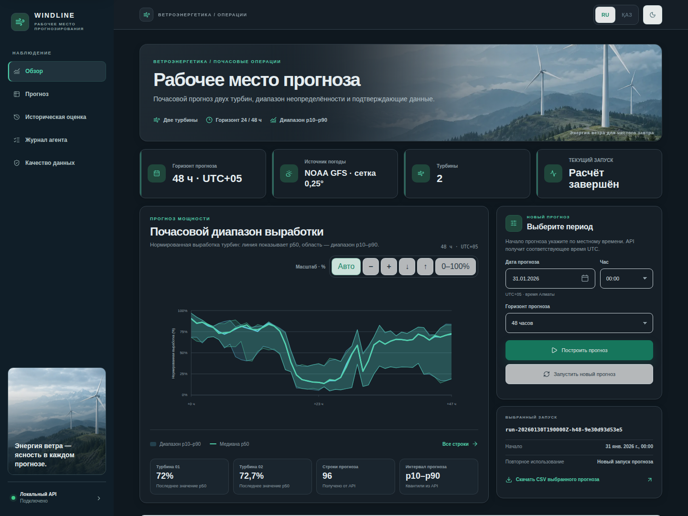
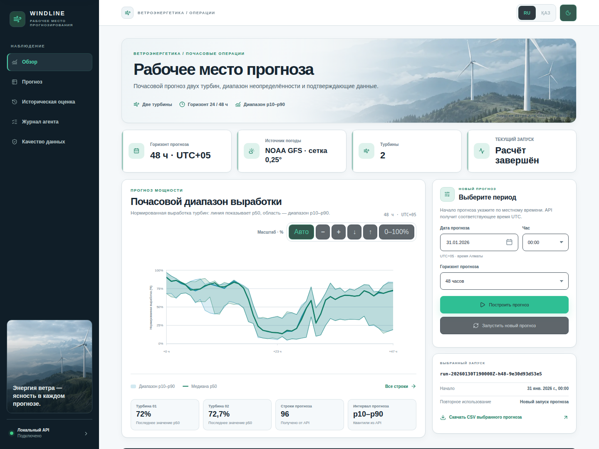
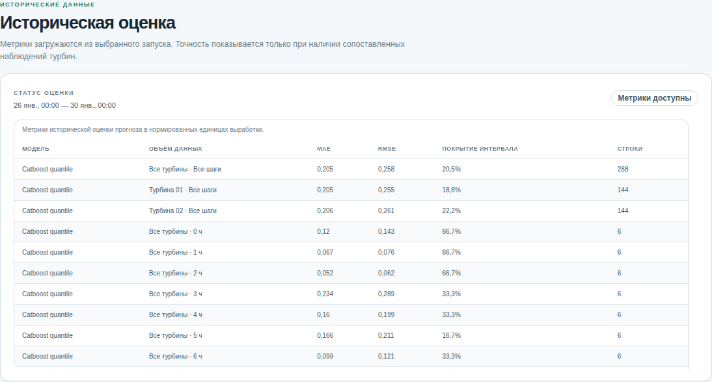

# Windline — воспроизводимый прогноз ветровой генерации

Windline строит почасовой прогноз нормированной активной мощности двух ветровых турбин на 24 или 48 часов. Проект объединяет проверку исходных наблюдений, погодные данные с временной проверкой происхождения, ML-модели и базовые методы, журнал действий агента и локальную панель.

Публичного развёртывания сейчас нет: приложение рассчитано на локальный запуск. Панель Astro/Lumen обращается к локальному FastAPI; Streamlit оставлен как запасной интерфейс.

## Интерфейс

Скриншоты работающей локальной версии: реальные архивные прогнозы NOAA GFS, CatBoost и сохранённый запуск на 31 января 2026 года. Изображение ветропарка в шапке — декоративное, не фотография площадки.



<details>
<summary>Светлая тема и историческая оценка</summary>





</details>

## Задача и пользователи

Решение предназначено для участников HackAlem и специалистов, которым нужно воспроизвести прогноз выработки по истории двух турбин и проверить, какие данные, модель и правила использованы. Оно показывает интервальный прогноз, качество входной истории, происхождение погоды и доступные результаты исторической оценки.

Исходные CSV содержат десятиминутные наблюдения для двух турбин. Они не являются готовыми train/test-выборками. Windline сначала проверяет и агрегирует их в почасовую историю, а затем строит признаки только из сведений, доступных на момент начала прогноза.

## Что реализовано

- Подготовка истории двух турбин: проверка структуры, чисел, временного порядка, дубликатов и пропусков; агрегация в часы при наличии не менее четырёх валидных наблюдений из шести.
- Горизонт 24 или 48 часов с почасовыми строками отдельно для каждой турбины и квантилями прогноза `p10`, `p50`, `p90`.
- CatBoost на CPU и базовые модели: persistence, seasonal и power curve. Историческая оценка использует временные rolling origins и сравнивает модели на общих доступных фактических значениях.
- Проверка доступности наблюдений и погодной информации относительно времени начала прогноза. Неизвестная или неподтверждённая доступность не считается доказанной только по времени инициализации модели.
- Ограниченный агентный цикл: проверка погоды, подготовка признаков, получение прогноза, анализ заранее разрешённых диагностик и запись результата. При отсутствии `OPENAI_API_KEY` работает детерминированный анализатор; LLM не подменяет прогнозную модель.
- Сохраняемые результаты, проверяемые по манифесту: прогноз CSV, метрики JSON, погода и происхождение JSON, журнал событий JSONL, отчёт Markdown и манифест.
- Локальная панель на Astro и Lumen с разделами прогноза, исторической оценки, трассы агента и качества данных; доступны русский и казахский тексты, светлая и тёмная темы.
- Вертикальный масштаб графика: приближение/отдаление, сдвиг вверх/вниз, «Авто» по диапазону квантилей и сброс «0–100%». Масштаб меняет только отображение, не прогнозные значения.
- Локализованный календарь и отдельный выбор часа в формате 00–23 (UTC+05); таблицы с прокруткой, скачивание CSV и понятные пояснения всех этапов агента с раскрываемой диагностикой.

Успешный или degraded-запуск может содержать все шесть артефактов; неуспешный запуск не публикует фиктивный CSV прогноза. Состояние `degraded` означает, что результат получен с ограничением, например после перехода на baseline, и его нужно читать вместе с отчётом и provenance.

## Стек и архитектура

- **Python 3.11+**: подготовка истории, признаки, обучение, оценка, агент и CLI.
- **pandas, NumPy и CatBoost**: табличная обработка и квантильные модели. CatBoost запускается на CPU; стандартная конфигурация — 250 итераций, четыре потока и seed 42.
- **FastAPI и Uvicorn**: локальный API над тем же сервисом приложения, который использует CLI.
- **Astro, TypeScript и Lumen UI**: браузерная панель. Astro проксирует `/api` на API, запущенный на `127.0.0.1:8000`.
- **Streamlit**: сохранённый резервный интерфейс над тем же сервисом.
- **Open-Meteo Single Runs, модель `ecmwf_ifs`**: погодный источник по умолчанию. Его архивные данные сами по себе не доказывают точное время публикации; в competition-режиме provenance gate не принимает неподтверждённую доступность.
- **NOAA GFS + ecCodes**: источник архивных прогнозов с ограниченным чтением GRIB-полей. На 17 проверенных архивных началах обучен отдельный CatBoost для NOAA: 1296 обучающих пар и 288 калибровочных. Прогноз на 31 января содержит 96 строк; внешний анализ OpenAI выполнен. Статус `degraded` связан с упорядочиванием квантилей в 15 строках, а не с резервной моделью.
- **OpenAI Responses API**: необязательный ограниченный анализ диагностик. Без ключа используется детерминированный анализатор.

Основной поток данных:

```text
CSV турбин → проверка и почасовая история → прогноз погоды и provenance gate
          → доступные на origin признаки → CatBoost / baseline
          → проверка сетки и квантилей → аудит, артефакты и локальная панель
```

CLI и API используют фасад `Application`; состав адаптеров создаётся через `build_runtime`. Артефакты записываются атомарно и получают content hashes для аудита и повторного использования результата. API остаётся однопроцессным и локальным: одновременно допускается одна активная задача прогноза.

Основные каталоги: `wind_forecast/` — Python-приложение и адаптеры, `frontend/` — рабочий Astro-интерфейс, `tests/` и `frontend/tests/` — проверки, `docs/` — документация. `artifacts/` и `.cache/` содержат локальные результаты и погодный кэш и не входят в Git. Старый дизайн-прототип и временные материалы разработки не нужны для запуска и исключены из состава проекта.

## Воспроизводимый запуск

Команды выполняются из корня репозитория. Два предоставленных CSV уже лежат здесь; если используется другая папка, передайте её через `--data-dir` или `DATA_DIR`. Файлы должны оканчиваться на `turbine 1.csv` и `turbine 2.csv` (либо `turbine_1.csv` и `turbine_2.csv`).

### 1. Установка

Нужны Python 3.11+, Node.js 22.19+ и npm. Для повторяемости Python-зависимости берутся из lock-файла; фронтенд устанавливается по `package-lock.json`.

```bash
python3 -m venv .venv
.venv/bin/python -m pip install --upgrade pip
.venv/bin/python -m pip install -r requirements.lock.txt
.venv/bin/python -m pip install --no-deps -e .
cp -n .env.example .env

cd frontend
npm ci
cd ..
```

NOAA не требует API-ключа. OpenAI необязателен: без ключа работает детерминированный анализатор. Не добавляйте настоящий ключ в README, исходный код или артефакты; `OPENAI_API_KEY` хранится только в локальном `.env` или окружении процесса. Не перезаписывайте существующий `.env`, если он уже настроен.

### 2. Подготовка, обучение и оценка

Подготовьте реальные CSV:

```bash
.venv/bin/python -m wind_forecast.cli prepare
```

Для первого ограниченного запуска используйте NOAA и отдельные каталоги:

```bash
export RUN_MODE=competition WEATHER_PROVIDER=noaa_gfs AUTO_TRAIN_MODEL=0
export CACHE_DIR=.cache/wind-gfs MODEL_DIR=artifacts/models-gfs RUN_DIR=artifacts/runs-gfs-evaluated
```

`AUTO_TRAIN_MODEL=0` предотвращает неожиданную загрузку большого погодного архива при первом запросе. Готовая модель своего источника загружается; если её нет, агент явно переходит на baseline и сохраняет `degraded`. Модель Open-Meteo не переиспользуется как модель GFS.

Обученная NOAA-модель сейчас есть в локальной рабочей среде, но её веса и кэш не входят в репозиторий. В чистом клоне сначала выполните обучение ниже: оно загрузит недостающие архивы GFS. Если сразу запустить прогноз с `AUTO_TRAIN_MODEL=0`, приложение без такой модели вернёт явно отмеченный baseline.

Проверенный ограниченный запуск обучения использует начала 12–25 января и калибровочные начала 26–28 января. Его можно воспроизвести следующей командой (первое скачивание архивов занимает существенно больше времени, чем сам fit):

```bash
WEATHER_PROVIDER=noaa_gfs CACHE_DIR=.cache/wind-gfs MODEL_DIR=artifacts/models-gfs RUN_DIR=artifacts/runs-gfs-evaluated \
  .venv/bin/python -m wind_forecast.cli train --mode competition --train-start 2026-01-12 --train-end 2026-01-25 --calibration-start 2026-01-26 --calibration-end 2026-01-28
```

Полное обучение на диапазоне по умолчанию и январский backtest запускаются **отдельно**, когда есть время и сетевой бюджет: команды ниже могут скачать много архивных полей. Их успешное завершение на всём реальном периоде пока не заявлено.

```bash
WEATHER_PROVIDER=noaa_gfs CACHE_DIR=.cache/wind-gfs MODEL_DIR=artifacts/models-gfs RUN_DIR=artifacts/runs-gfs-evaluated \
  .venv/bin/python -m wind_forecast.cli train --mode competition
WEATHER_PROVIDER=noaa_gfs CACHE_DIR=.cache/wind-gfs MODEL_DIR=artifacts/models-gfs RUN_DIR=artifacts/runs-gfs-evaluated \
  .venv/bin/python -m wind_forecast.cli backtest --mode competition
```

Проверенный короткий backtest на уже загруженном архиве:

```bash
WEATHER_PROVIDER=noaa_gfs CACHE_DIR=.cache/wind-gfs MODEL_DIR=artifacts/models-gfs .venv/bin/python -m wind_forecast.cli backtest --mode competition --start 2026-01-26 --end 2026-01-28 --history-start 2026-01-12 --calibration-days 3
```

Три независимых временных фолда, 288 сопоставленных прогнозных строк на модель. Это небольшой январский тест, не оценка всего февраля. На нём CatBoost: MAE **0,2054**, RMSE **0,2578**, покрытие p10–p90 **20,49%**. Power curve: MAE **0,1677**, RMSE **0,2732**; persistence: MAE **0,4702**. Мощность нормализована в [0,1]: MAE 0,2054 соответствует 20,54 процентного пункта, не «20,54% относительной ошибки». CatBoost лучше по RMSE, power curve — по MAE; низкое покрытие интервалов CatBoost требует улучшения. Перекрывающиеся горизонты не являются независимыми наблюдениями. Метрики и построчные предсказания сохранены в `artifacts/models-gfs/backtest/`; активная модель при backtest не изменяется.

`backtest` выполняет скользящую оценку по январским началам и сравнивает persistence, seasonal, power-curve и CatBoost. Погодные прогнозы каждого начала должны пройти проверку исторической доступности. Полные параметры обучения и калибровки доступны через `train --help` и `backtest --help`.

По умолчанию кэш находится в `.cache/wind`, модели — в `artifacts/models`, а результаты запусков — в `artifacts/runs`. Параметры `--cache-dir`, `--model-dir` и `--run-dir` меняют эти пути.

### 3. Один прогноз и ежедневная симуляция

Начало прогноза задаётся часовым ISO-8601 временем с часовым поясом. Для сценария с фиксированным UTC+05 начало 31 января в полночь можно записать и в эквивалентном UTC-виде:

```bash
.venv/bin/python -m wind_forecast.cli run --mode competition \
  --origin 2026-01-31T00:00:00+05:00 --horizon 48
```

Ежедневный сценарий с полуночным началом UTC+05 с 31 января по 28 февраля включительно:

```bash
.venv/bin/python -m wind_forecast.cli simulate --mode competition \
  --start 2026-01-31 --end 2026-02-28
```

Для этой сетки ожидаются **29 начал**, **96 строк на запуск** и **2784 строки суммарно** (перекрывающиеся часы относятся к разным началам). Полный NOAA-прогон этого диапазона ещё не выполнен; сетевой объём значительно больше одного запуска. Предыдущая offline-симуляция 1–28 февраля охватывала 28 начал на синтетической погоде и не заменяет реальный прогон или оценку точности.

В CLI также доступны `--cache-dir`, `--model-dir`, `--run-dir`, `--refresh`, временные границы обучения/калибровки, число итераций и путь к demo-only weather fixture. Полный список параметров:

```bash
.venv/bin/python -m wind_forecast.cli --help
.venv/bin/python -m wind_forecast.cli run --help
```

### 4. Панель и локальный API

Запустите API и Astro в двух терминалах из корня репозитория. Это локальный сценарий с реальным NOAA, а не публичное production-развёртывание:

```bash
RUN_MODE=competition WEATHER_PROVIDER=noaa_gfs AUTO_TRAIN_MODEL=0 DEMO_OFFLINE=0 \
  CACHE_DIR=.cache/wind-gfs MODEL_DIR=artifacts/models-gfs RUN_DIR=artifacts/runs-gfs-evaluated \
  .venv/bin/python -m wind_forecast.presentation.api --host 127.0.0.1 --port 8000
```

```bash
cd frontend
npm run dev
```

Откройте <http://127.0.0.1:4321>. API предоставляет `/api/health`, `/api/runs/latest`, `/api/runs/{run_id}`, `POST /api/forecast-jobs`, чтение состояния задачи и загрузку CSV прогноза. Для демонстрации с полностью офлайн погодой запустите API вместо первой команды так:

```bash
RUN_MODE=demo DEMO_OFFLINE=1 .venv/bin/python -m wind_forecast.presentation.api \
  --host 127.0.0.1 --port 8000
```

API использует конфигурацию серверного процесса: браузер не может переключить режим или источник. Подробности по маршрутам и ограничениям приведены в [документации API](docs/API.md). Запасной Streamlit-интерфейс можно запустить так:

```bash
RUN_MODE=demo DEMO_OFFLINE=1 .venv/bin/streamlit run app.py
```

### 5. Проверки проекта

```bash
.venv/bin/pytest -q
cd frontend
npm test
npm run check
npm run build
```

Перед показом проверяйте фактический результат команды и статус погоды в панели или отчёте запуска. Код `competition` не превращает недоказанную историческую доступность погоды в проверенную.

## Как проверить решение жюри

1. Выполнить установку и подготовку CSV, настроить NOAA переменными окружения выше.
2. Запустить один CLI-прогноз на `2026-01-31T00:00:00+05:00`, 48 часов. Проверить в выводе режим, статус и каталог артефактов; baseline должен быть явно отмечен как ограниченный результат.
3. Открыть панель на порту 4321: проверить NOAA как источник, две турбины, 48 часов, интервалы p10–p90 и карточку происхождения данных.
4. Скачать CSV: 96 строк плюс заголовок. В манифесте проверить, что `available_at` погодного источника предшествует origin; открыть журнал этапов агента.
5. Повторить тот же запуск с `--refresh` или кнопкой повторного расчёта. При неизменных данных и коде ожидается повторное использование результата; обновившиеся входы требуют нового запуска.
6. Переключить RU/ҚАЗ и тему, проверить сохранение настроек после обновления страницы. Январские метрики и февральскую симуляцию оценивать отдельно: отсутствие февральского факта должно быть явно указано.

## Данные, интеграции и временные правила

- Поставленные организаторами CSV названы диапазоном до 28.02.2026, но их последняя фактическая строка — **2026-01-31 23:50**. Февральских наблюдений мощности в этих файлах нет.
- Активная мощность нормирована и хранится в диапазоне `[0, 1]`. Это **не МВт**: для пересчёта нужна подтверждённая номинальная мощность каждой турбины.
- Наивные метки времени в исходных CSV трактуются текущей политикой как UTC+05 и затем сохраняются в UTC. Это явное допущение, а не подтверждение исторической временной зоны источника.
- Часовое наблюдение доступно после его завершения. Признаки прогноза используют только строки с `available_at <= origin`; прогнозные `lead_hours` нумеруются от 0.
- Синтетическая погода предназначена для офлайн-демо. Архивные Open-Meteo Single Runs не дают подтверждения точного времени публикации нужного прогноза. Не называйте такую погоду проверенной только потому, что известны время инициализации или скачивания.
- Адаптер NOAA GFS проверяет диапазоны байтов, версии объектов и метаданные GRIB. Время доступности — консервативная верхняя граница публикации S3, не точное время выпуска NCEP. Для проверенного начала `2026-01-31T00:00+05:00` использован цикл `2026-01-30T06:00Z`, публикация требуемых объектов не позднее `2026-01-30T10:02:14Z`, то есть до origin `2026-01-30T19:00Z`. Проверены все 48 часов и семь погодных полей; обе турбины попадают в одну крупную ячейку GFS 0,25°.
- Январский backtest допустим только там, где имеются реальные целевые наблюдения и погодный источник, доступный до каждого начала. Синтетические offline-метрики — инженерная проверка, а не оценка качества прогноза.
- Симуляция февраля не измеряет точность: фактической февральской мощности нет. Не заполняйте её последними прогнозами и не рисуйте метрики на вымышленных наблюдениях.

Подробный русскоязычный протокол приёмки, временная сетка и 5–7-минутный сценарий защиты находятся в [docs/VALIDATION_FLOW_RU.md](docs/VALIDATION_FLOW_RU.md). Протокол описывает проверки и критерии; он не означает, что каждый внешний источник уже принят.

## Ограничения и готовность к развёртыванию

- Отдельный NOAA CatBoost обучен на коротком январском окне; сохранён аудит остаточных ошибок на более поздних калибровочных данных. Интервалы строятся непосредственно квантильными моделями, а не этим аудитом (`used_for_intervals=false`). Проверенный запуск `run-20260130T190000Z-h48-9e30d93d53e5` использует CatBoost и OpenAI-анализ; 15 из 96 строк потребовали упорядочивания квантилей. Выполнен короткий rolling backtest на началах 26–28 января; полный январь и весь февральский прогон ещё не выполнены. `competition_valid=true` — проверка входной погоды, не доказательство точности ML-модели или готовности публичного production-сервиса.
- Для этой версии нет публичной демонстрационной ссылки. FastAPI ограничен `127.0.0.1`/`localhost`, не имеет аутентификации и рассчитан на один локальный процесс; не выставляйте его в интернет без отдельной защиты.
- Метаданные незавершённых API-задач хранятся в памяти процесса и теряются при его перезапуске. Сохранённые артефакты запусков остаются на диске.
- Для Astro 5.18.2 зафиксированы нерешённые замечания аудита безопасности. Считайте фронтенд локальным демо до обновления зависимости и повторной проверки.
- CatBoost и базовые модели дают прогнозы, но отсутствие февральского факта и непроверенные источники/периоды вне принятого NOAA-горизонта ограничивают выводы о качестве и калибровке интервалов.

## Материалы

- [Локальный API](docs/API.md)
- [Протокол проверки для защиты](docs/VALIDATION_FLOW_RU.md)
- [Архитектурный план](docs/architecture/2026-09-23-modular-redesign.md)
