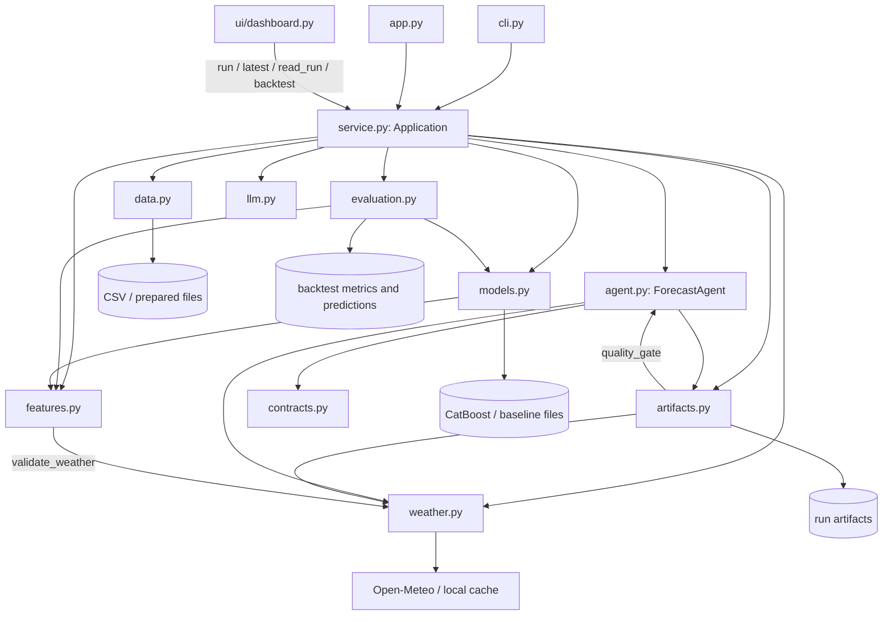

# Incremental modular redesign

**Status:** architecture audit and migration proposal; no product code moved.
**Scope:** preserve the current Python, CLI, Streamlit and artifact behavior while
making the shared application logic easier to test and change. This follows the
repository architecture skill: modular monolith, inward dependencies, meaningful
ports, cohesive ML modules, thin presentation, and small behavior-preserving steps.

## Constraints to preserve

- Keep `python -m wind_forecast.cli {prepare,train,backtest,run,simulate}` and
  `streamlit run app.py` working. Keep `wind_forecast.service.Application` and
  its methods (`prepare`, `train`, `run`, `backtest`, `simulate`, `latest`,
  `read_run`) as compatibility entry points during migration.
- Retain the existing request, forecast, manifest, metrics, event and weather
  schemas; run reuse and model cache identities; atomic artifact publication;
  CLI options; deterministic offline behavior; and the same application layer
  behind CLI and Streamlit.
- Preserve point-in-time rules: UTC-aware public timestamps; fixed `UTC+05:00`
  interpretation of naive source timestamps; observations only when
  `available_at <= origin`; verified weather only when its proven availability
  is no later than origin; lead hours `0..H-1`; no fabricated February truth or
  competition metrics. Keep demo-only synthetic or unverified weather labeled.
- Keep the MVP Streamlit runtime. Use the supplied Astro/Lumen bundle as the
  visual reference for the current dashboard work. A real Astro client and API
  are optional future work: this redesign does not add an API subsystem or
  change the approved Streamlit contract.
- Do not move or edit code while the integration, agent, or UI owners have live
  edits in those files. This proposal is not a request to interrupt them.

## Current responsibility and dependency map

The project is currently a flat `wind_forecast` package (configured by
`pyproject.toml` package discovery), with tests in `tests/` rather than layer
directories. Direct imports and runtime wiring show these relationships:



Current responsibilities and evidence:

| Current module | Actual responsibility / coupling |
|---|---|
| `service.py` (945 lines) | `Application` spans source preparation, caching, model lifecycle, run/backtest/simulation orchestration and run reads. Its constructor selects concrete weather, analyzer, data, feature and artifact implementations (`service.py:143-180`); `run` builds predictor closures and a `ForecastAgent` (`695-761`). |
| `agent.py` (976 lines) | Owns quality policy, the fetch/cache/retry/predict/decision workflow, fingerprints, manifest/report construction and persistence calls. `ForecastAgent` accepts `Any` for the provider/store; `run` starts the workflow at `283`; `_persist` builds metadata and calls storage at `802-828`. |
| `artifacts.py` (821 lines) | Filesystem run store, schema encoding, fingerprint/reuse logic, locks and atomic publication. It imports `quality_gate` from the agent and runs that policy before writing (`artifacts.py:22,213-230`), creating a store-to-agent dependency. |
| `features.py` (426 lines) | Feature construction and input checks; it imports `validate_weather` from the infrastructure-like weather module (`features.py:10-11,124-130`). |
| `models.py` (831 lines) | Baselines, CatBoost fitting/prediction/calibration plus local serialization and integrity checks (`models.py:405-435,700-831`). |
| `evaluation.py` (521 lines) | Metrics and rolling-origin model evaluation, but also writes `metrics.json` and `predictions.csv` (`evaluation.py:504-520`). |
| `weather.py` (804 lines) | Provenance rules, weather validation/fingerprints, HTTP provider, local response cache and synthetic fixtures. `WeatherProvider` begins at line 322. |
| `data.py` (391 lines) | CSV reading, source parsing, UTC normalization, validation and hourly aggregation (`data.py:109-180`). |
| `contracts.py` (91 lines) | Shared request/result/action records; it also imports pandas and carries DataFrames, `Path`, and serialization-oriented data (`contracts.py:1-65`). |
| `cli.py`, `app.py`, `ui/` | CLI parses commands and constructs `Application` (`cli.py:96-114`); `app.py` is the Streamlit entry point. The dashboard calls public application methods (`ui/dashboard.py:105-172,414-416`) and includes rendering and layout logic (546 lines). |

The dependency issue is not simply file length. Five modules exceed 700 lines,
and some boundaries point outward: storage imports agent policy; ML features
import weather infrastructure; ML evaluation writes files; the service is both
composition root and broad workflow facade. `StagedPredictor` is a useful
existing `Protocol` in `agent.py:25-45`, but there are no shared typed ports for
weather, analysis, model persistence or run storage. The current product is
still one deployable application; none of this calls for services, a database,
an API, or a dependency-injection framework.

### Ranked shortcomings

1. **The application facade is also a composition root and workflow coordinator.**
   `Application.__init__` selects concrete providers and storage
   (`service.py:143-180`), while `run`, `train` and `backtest` directly join
   source access, model lifecycle, feature building, weather and persistence
   (`service.py:413-455,695-761,799-843`). This makes a single behavior change
   span the whole service module (945 lines) and makes isolated use-case tests
   harder.
2. **Run storage and agent policy are mutually entangled.**
   `artifacts.py` imports and invokes `agent.quality_gate` before storage
   (`artifacts.py:22,213-230`), while `ForecastAgent` owns both the decision
   workflow and manifest/report construction (`agent.py:266-310,802-860`).
   This leaves a 976-line agent on the normal forecast path and makes the
   storage adapter decide forecasting validity.
3. **The ML boundary reaches into provider infrastructure and the filesystem.**
   `features.py` imports provider weather validation (`features.py:10-11,124-143`);
   `ForecastModel` and `BaselineModel` write/read their files inside `models.py`
   (`models.py:405-435,700-831`); rolling evaluation writes metrics and
   predictions itself (`evaluation.py:504-520`). This complicates alternate
   persistence and pure calculation tests.
4. **Weather combines pure contract rules with network/cache implementation.**
   `WeatherProvider` owns transport and cache (`weather.py:322-428,604-688`),
   while the same module owns validation and fingerprinting (`weather.py:104-163`).
   Those rules are reused by both `features.py` and the agent, so splitting the
   policy from transport removes a real import edge without changing provider
   behavior.
5. **The package and shared records do not show ownership in their paths.**
   All product concerns are direct children of `wind_forecast/`; the 91-line
   `contracts.py` combines pure request/action values with pandas frames and
   filesystem paths (`contracts.py:1-65`). The flat layout currently supports
   the public launch commands, so reorganize only after stable shims and
   package-install checks exist.
6. **Presentation is a large single Streamlit module, but currently owned.**
   `ui/dashboard.py` is 546 lines and composes controls, state handling and five
   views (`ui/dashboard.py:105-172,237-414`). Keep the existing active visual
   redesign, use the Astro/Lumen bundle for visual direction, and split only
   after its owner releases the UI and the `Application` API is frozen.

## Proposed target and dependency direction

```text
presentation/cli ───────┐
presentation/dashboard ─┴──> application use cases ───> domain rules / DTOs
agents/tools ────────────────────┘             │
                                               ├──> ML features / models / evaluation
                                               └──> application ports
infrastructure adapters ───────────────────────────> application ports / DTOs
bootstrap ──> concrete infrastructure + use cases + presentation entry points
```

`bootstrap` is the only normal place that selects concrete providers and stores.
Application use cases own the deterministic sequence and policies. ML modules
own feature, training, prediction and scoring calculations. Infrastructure
owns CSV/HTTP/cache/model/run serialization. Agents may request only named
application actions and explain precomputed diagnostics; removing the LLM must
not remove forecasting. Ports should be limited to real replaceable boundaries:
weather fetch/cache, model load/save, run artifact storage, and optional
diagnostic analysis. Prefer the current `StagedPredictor` protocol shape where
it represents an actual staged prediction contract; do not add a port for each
class.

| Current path | Target ownership | Migration note |
|---|---|---|
| `contracts.py` | `application/contracts.py` plus only genuinely pure types in `domain/` | Split deliberately. Keep DataFrame-bearing snapshots/predictions and `Path`-bearing results out of a purportedly pure domain. Preserve `wind_forecast.contracts` as re-exports while callers migrate. |
| `service.py` | `application/forecasting/`, `application/training/`, `application/evaluation/`, `application/data_quality/` | Extract one use case at a time. Keep a small `Application` facade at `service.py` until all public methods delegate cleanly. |
| `agent.py` | `agents/forecast_agent.py` and application run coordination | Move deterministic fetch/validation/retry/predict/persist coordination into the application run use case. Agent remains an optional bounded advisor/tool adapter. Preserve event order, allowed decisions, retry limits and manifest content. |
| `artifacts.py` | `infrastructure/persistence/run_store.py` | Keep schemas, hashes, content-based reuse, lock behavior and atomic rename byte-compatible. Remove policy decisions from the filesystem adapter only after the application validates before calling it. |
| `data.py` | `infrastructure/datasets/csv_history.py` | Keep source parsing and I/O here; retain tested hourly rules and `DataPipeline` import shim. Move no timestamp semantics without a separate data decision. |
| `weather.py` | `infrastructure/weather/open_meteo.py`, `cache.py`, `synthetic.py`; shared provenance contract/policy under application | Separate pure validation/fingerprinting from HTTP/cache code before ML or application callers change imports. Re-export old public names during transition. |
| `features.py` | `ml/features/` | Keep feature schema/order, training-row identity and all point-in-time checks stable. It must consume validated data without importing the HTTP/cache adapter. |
| `models.py` | `ml/models/baselines.py`, `ml/models/catboost.py`, `ml/training/` | Separate only after class APIs and serialized metadata have tests. Move `.cbm`/JSON file management behind a model repository; keep lazy CatBoost import and model fingerprints. |
| `evaluation.py` | `ml/evaluation/metrics.py`, `ml/evaluation/rolling.py` | Make scoring/backtest calculations return typed results; move output writes to application/infrastructure while preserving the current `rolling_backtest` return keys during transition. |
| `llm.py` | `infrastructure/llm/openai_analyzer.py` | Keep an `Analyzer` port at the application boundary and deterministic fallback in application policy/bootstrap. |
| `cli.py`, `app.py`, `ui/` | `presentation/cli/`, `presentation/dashboard/` | Keep root `app.py` and `wind_forecast.cli` as thin compatibility launchers. Streamlit remains a presentation adapter. Feature-oriented Astro structure applies only if the product later adopts a separate Astro client. |
| `config.py` | `config/settings.py` | Centralize environment and paths; keep `wind_forecast.config.Settings` import stable during migration. |

The eventual `src/wind_forecast/` layout is justified by a real package boundary,
but should be last. Today root imports support both the public `python -m`
command and `streamlit run app.py`; moving early adds editable-install and
launcher risk while modules are still changing. Do not keep two active
`wind_forecast` implementations: move the canonical package once, configure
setuptools discovery, install it in the documented environment, and validate
both public commands before removing the old tree.

## Incremental migration batches

Each batch is independently reviewable and behavior-preserving. Run the focused
tests named below first and the complete current behavior suite before advancing.
Write each test before its implementation and confirm it fails for the intended
behavior. No batch should be merged into a broad rename.

| Batch | Exact path scope | Checks / compatibility and rollback boundary |
|---|---|---|
| **0. Release ownership gate** | No product paths. Orchestrator confirms owners have finished and reviewed edits to `service.py`, `cli.py`, `app.py`, `agent.py`, `artifacts.py`, `ui/` and their tests. | Capture baseline `git status`; run the current full suite; review published CLI, `Application`, schemas and cache identities. If an owner is still editing, defer the batch. |
| **1. Composition root and first ports** | Add `wind_forecast/application/__init__.py`, `wind_forecast/application/ports.py`, `wind_forecast/bootstrap.py`, `tests/test_bootstrap.py`; edit only `wind_forecast/service.py`. | Move the concrete constructor choices now at `Application.__init__` into a `build_runtime(...)` composition function. Keep `Application(settings, *, offline, weather_fixture, weather_provider, analyzer, model_parameters)` and all methods/signatures. Keep `cli.py` and `app.py` unchanged; they still construct the facade. Test injected-dependency precedence, offline synthetic selection, and fixture validation through real returned components. Run `tests/test_cli.py`, `tests/test_e2e.py`, `tests/test_acceptance.py`, then the full suite. Roll back only this batch's new files and service diff if the public paths or constructor behavior change. **This is the first independently implementable product batch after owner release.** |
| **2. Extract pure forecast/provenance policy** | Add `wind_forecast/application/forecasting/quality.py` and `wind_forecast/application/forecasting/weather_policy.py`; edit `agent.py`, `artifacts.py`, `features.py`, `weather.py`; add `tests/test_architecture.py`. | Move `quality_gate`, weather provenance checks and canonical fingerprint rules out of agent/provider modules. Preserve `agent.quality_gate` and `weather.validate_weather` as re-exports. Then make feature building depend on the shared policy and make storage serialize already-validated run data. Architecture check rejects imports from ML/application policy into infrastructure implementations and storage into agents. Run `tests/test_agent.py`, `test_artifacts.py`, `test_weather.py`, `test_features.py`, `test_acceptance.py`, then full suite. Roll back this boundary move as a unit; schema and hashes must remain unchanged. |
| **3. Move run workflow ownership inward** | Add `wind_forecast/application/forecasting/generate_forecast.py`; edit `service.py`, `agent.py`, `artifacts.py`; add/update `tests/test_run_use_case.py`, `tests/test_agent.py`, `tests/test_e2e.py`. | Application use case owns deterministic fetch, safe cache choice, retry/baseline policy, quality gate, and persistence request. `ForecastAgent.run` remains a compatibility delegate while the optional analyzer is constrained to existing action values. Preserve exact event transitions, two-call/three-attempt limits, reuse behavior and manifest fields. Run agent/artifact/CLI/E2E/acceptance modules then full suite. Roll back the use-case extraction together; do not leave old and new workflows both active. |
| **4. Separate ML calculations from persistence** | Add `wind_forecast/ml/features/builder.py`, `wind_forecast/ml/models/baseline.py`, `wind_forecast/ml/models/catboost_quantile.py`, `wind_forecast/ml/training/calibration.py`, `wind_forecast/ml/evaluation/rolling_backtest.py`, and `wind_forecast/infrastructure/persistence/model_repository.py`; edit `features.py`, `models.py`, `evaluation.py`, `service.py`; add/update feature/model/evaluation tests. | Extract one cohesive area at a time: first scoring/result serialization, then CatBoost and baseline storage. Keep old module names as imports to the single canonical implementation. Assert model metadata schema, file hashes, feature order, training fingerprints, cache identities and backtest result keys remain stable. Run `tests/test_features.py`, `test_models.py`, `test_evaluation.py`, `test_acceptance.py`, then full suite. Roll back each extraction separately; never retrain or silently change cache keys as part of a move. |
| **5. Split data and weather adapters** | Add `wind_forecast/infrastructure/datasets/csv_history.py`, `wind_forecast/infrastructure/weather/{open_meteo,cache,synthetic}.py`; edit `data.py`, `weather.py`, `bootstrap.py`, `service.py`; add/update `tests/test_data.py`, `test_weather.py`, `test_features.py`. | Move transport, source file and cache I/O behind existing behavior. Keep old provider/pipeline import paths as shims; retain cache filenames and canonical weather fingerprint inputs. Run data/weather/features/acceptance and full suite. Roll back per adapter group without changing source-time policy or provenance claims. |
| **6. Reduce application facade; organize presentation/tests** | Add `wind_forecast/application/training/train_model.py`, `wind_forecast/application/evaluation/run_backtest.py`, `wind_forecast/application/data_quality/inspect_history.py`, `wind_forecast/presentation/cli.py`, and `wind_forecast/presentation/dashboard.py`; edit `wind_forecast/service.py`, `wind_forecast/cli.py`, `app.py`, `wind_forecast/ui/dashboard.py`, `pyproject.toml`; migrate tests only after imports settle. | Keep `service.Application`, `wind_forecast.cli`, root `app.py`, dashboard method calls and five dashboard sections as shims/composition. UI work can proceed separately once the current UI owner is done and the application API is frozen. Run CLI/dashboard/E2E/acceptance, browser checks required by the UI task, and full suite. Roll back the facade or presentation extraction without changing use-case behavior. |
| **7. Optional `src/` packaging move** | One atomic move of canonical `wind_forecast/` to `src/wind_forecast/`; edit `pyproject.toml`, launcher docs and packaging tests. | Only after batches 1–6 and a clean import boundary. Configure package discovery; verify editable installation, `python -m wind_forecast.cli --help`, every CLI command smoke path, and `streamlit run app.py`; run all tests from a clean environment. Keep one active package tree. Roll back the single move and packaging config together; no `git reset` or destructive cleanup. |

### Ownership and parallel work

The active task owners named in the board/plan retain their files until their
work is complete and reviewed: integration owns `service.py`, `cli.py`,
`app.py`, CLI/E2E and README; agent/reuse owns `agent.py`, `artifacts.py` and
related tests; UI owns `ui/**` and dashboard tests; ML owns feature/model/
evaluation files; data and weather own their adapters. The orchestrator should
announce the batch and receive each affected owner's release before touching
those paths. No refactor should overlap a live feature edit.

After the release gate, UI presentation cleanup can run independently from an
ML-only extraction if both consume the frozen `Application` API and disjoint
tests. Data parsing and weather adapter work can be reviewed separately only
after the shared provenance contract is frozen. Do not parallelize changes to
`contracts.py`, bootstrap/service wiring, the agent/store pair, model/feature
schema, or package root: those are coupled integration seams and need one
integrator and a pause on competing edits.

## Verification strategy and remaining decisions

Keep the current behavior suite at its existing paths during the moves:
`tests/test_{contracts,data,weather,features,models,evaluation,agent,artifacts,cli,dashboard,e2e,acceptance}.py`.
The plan describes roughly 146 behavior checks; count them from collection
output when the refactor starts rather than freezing an assumed number. Add
boundary tests for application/ML/infrastructure imports and keep the full
suite as the release gate. The test must catch an inward-dependency violation,
not assert source text or private filenames.

Required compatibility checks include the CLI commands and options, constructor
injection and offline fallback, 24/48-hour two-turbine grid, UTC/+05:00 rules,
weather provenance, forecast/manifest/metrics/event schemas, model and weather
fingerprints, reuse and atomic failure behavior, no fabricated February metrics,
and browser-verified Streamlit layout. Do not use a visual reference migration
to imply API or runtime migration.

Open decisions stay explicit: the exact minimal port signatures should be
confirmed against finished integration/agent code; contract types with pandas
frames may remain application DTOs rather than be forced into a pure domain;
the `src/` packaging move is valuable but deferred until installed-launcher
behavior is verified. No database, HTTP API, task queue, frontend server or
new infrastructure is needed for this migration.
